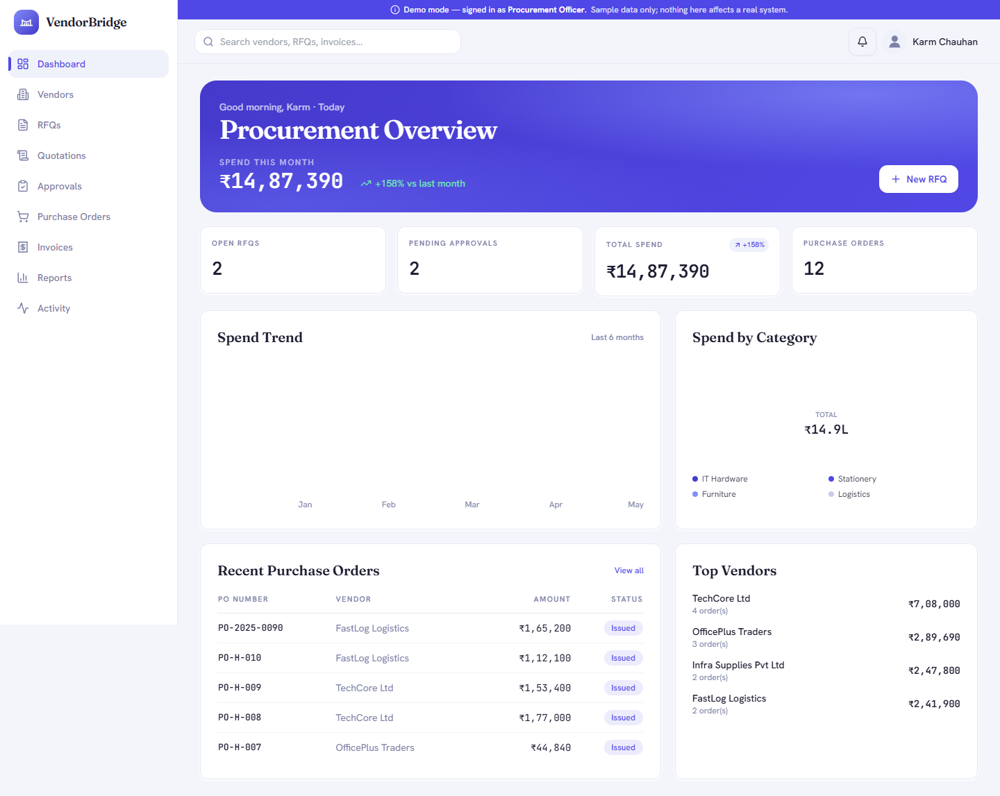
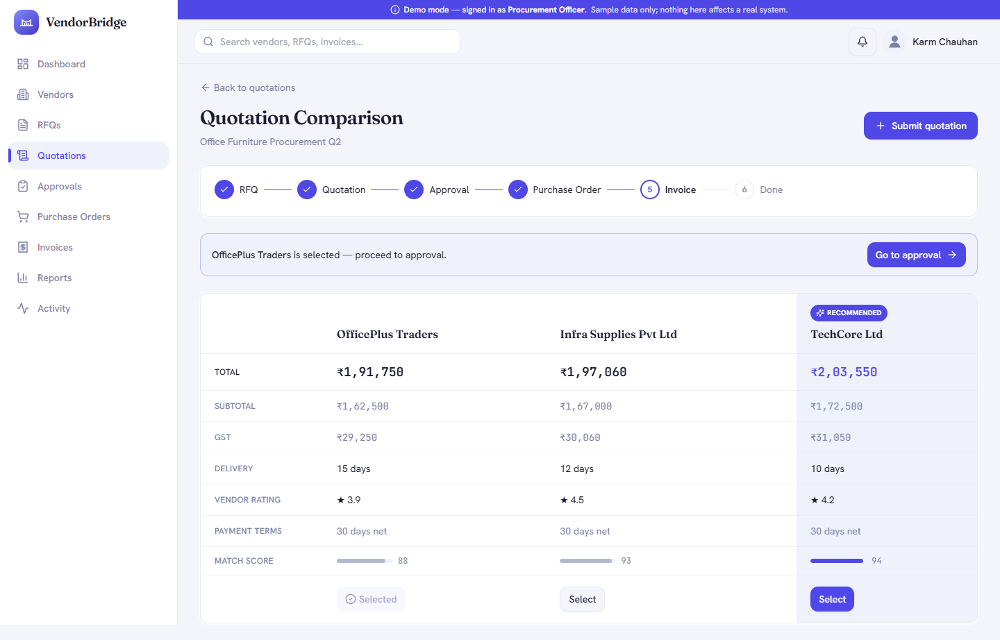
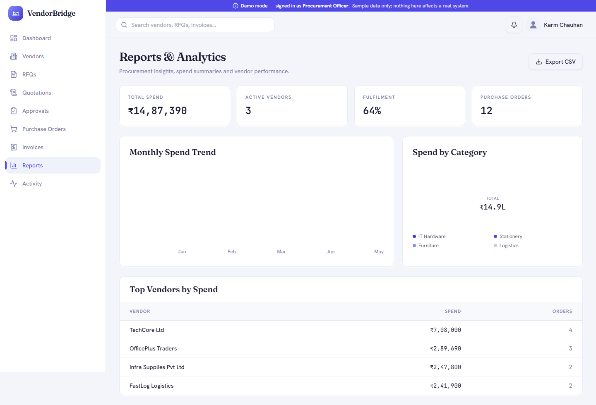
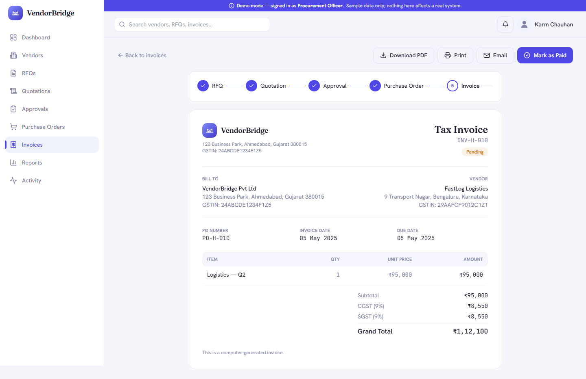

# VendorBridge

**A role-based Procurement & Vendor Management ERP** that digitizes the full vendor lifecycle:
RFQs to Quotation Comparison to Approvals to Purchase Orders to GST Invoicing — with real-time updates and analytics.

> Built for the Odoo / KSV Hackathon.

**Tech:** React · Vite · Tailwind · shadcn/ui · Express · Prisma · SQLite · Socket.io

---

## Live Demo

- **Live link:** _add your Vercel URL here_
- On the login screen, click **"Click here to open the demo"** — it signs in with sample data, no setup required.

## Screenshots

> Screenshots live in `docs/screenshots/`. Capture them from the running app and drop them in
> (`landing.png`, `dashboard.png`, `comparison.png`, `invoice.png`).

| Dashboard | Quotation Comparison |
|-----------|----------------------|
|  |  |

| Reports | GST Invoice |
|---------|-------------|
|  |  |

---

## Features

- **Authentication & Roles** — Email/password login & registration, JWT sessions, role-based route guards, and a one-click demo login (Procurement Officer, Manager, Vendor, Admin).
- **Dashboard** — Live KPIs, spend-trend and category charts, recent purchase orders, and top vendors.
- **Vendor Management** — Create/edit/search/filter vendors with category, GST, contact details and status.
- **RFQs** — Multi-step RFQ builder with dynamic line items and vendor assignment.
- **Quotations & Smart Comparison** — Vendor quotation submission and a side-by-side comparison that recommends the best quote using a weighted price/delivery/rating score, with a savings insight.
- **Approvals** — Multi-stage approval workflow with an action timeline, remarks, and state transitions.
- **Purchase Orders** — Auto-numbered POs generated from approved quotations.
- **Invoices** — Auto-numbered GST invoices (CGST + SGST) with PDF download, print, email, and payment status.
- **Reports & Analytics** — Spend by category, monthly trends, top vendors, and CSV export.
- **Activity Log** — A filterable audit trail of every action.
- **Real-time** — Live updates across the app via Socket.io.

## Tech Stack

| Layer | Technology |
|-------|-----------|
| Frontend | React, Vite, Tailwind CSS, shadcn/ui, React Router, TanStack Query, React Hook Form + Zod, Recharts, Framer Motion |
| Backend | Node.js, Express, Prisma ORM, SQLite, Socket.io |
| Auth | JWT, bcrypt, role-based middleware |
| Documents | @react-pdf/renderer (PDF), Nodemailer (email) |

## Architecture

```
React (Vite SPA)
   |  REST + WebSocket (Vite dev proxy)
   v
Express API  --->  Prisma ORM  --->  SQLite (local file)
   |
   +--> Socket.io (real-time events)
```

The frontend is organized by feature module (one folder per ERP domain); the backend exposes a REST API per resource with Zod validation and JWT/role guards.

## Getting Started

Prerequisites: **Node.js >= 18** and **npm >= 9**. No database server needed (SQLite is bundled).

```bash
git clone https://github.com/karm-tech/VendorBridge.git
cd VendorBridge
npm install      # installs frontend + backend deps and seeds the local database
npm run dev      # runs the API and web app together
```

Open **http://localhost:5173** and click **"Click here to open the demo"**.

### Demo accounts

All accounts use the password `demo1234`.

| Role | Email |
|------|-------|
| Procurement Officer | officer@vendorbridge.app |
| Manager | manager@vendorbridge.app |
| Vendor | vendor@vendorbridge.app |
| Admin | admin@vendorbridge.app |

## Project Structure

```
VendorBridge/
├── src/                      React frontend
│   ├── app/                  providers (auth, query)
│   ├── components/           ui (shadcn), layout, common, brand
│   ├── features/             one module per ERP domain
│   │   ├── auth/ dashboard/ vendors/ rfq/ quotations/
│   │   └── approvals/ purchase-orders/ invoices/ reports/ activity/ marketing/
│   ├── constants/  lib/      nav/roles/org, api client, utils, realtime
├── server/                   Express + Prisma backend
│   ├── src/ routes/ middleware/ lib/
│   └── prisma/ schema.prisma  seed.js
└── docs/                     setup guide & screenshots
```

## Scripts

| Command | Description |
|---------|-------------|
| `npm run dev` | Run backend API + frontend together |
| `npm run build` | Build the production bundle |
| `npm run preview` | Preview the production build |

## Releases

- **v1.0.0 — Foundation:** auth, design system, backend.
- **v2.0.0 — Core ERP:** vendors, RFQs, quotations, approvals, purchase orders, invoices.
- **v3.0.0 — Final:** reports, activity log, real-time, landing page.

---

<p align="center"><i>VendorBridge — Procurement & Vendor Management ERP</i></p>
